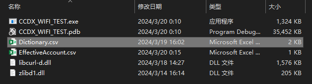
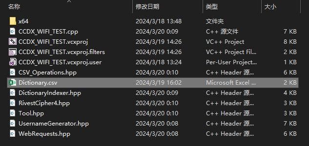

# CCDX WIFI TEST 
# CCDX-WIFI账号密码测试程序

## 1. 简介

CCDX-WIFI账号密码测试程序，这是目前为长春大学校园网开发的完成度最高、功能最完善的工具。它通过自动化的方式(使用不同的用户名和密码组合)尝试登录账户，避免了低效的密码穷举法，转而利用密码字典和科学的用户名生成方法，尤其针对弱密码实施有效检测。此外，程序还封装了多个辅助组件，以更全面地支持整个测试流程，旨在提升校园网账户的安全性。

---

## 2. 核心特性

- **用户名生成**：利用账号数字递增的特点，通过已知的两个有效用户名顺序生成中间用户名，这是一个简洁且有效的方法。支持随机模式、顺序模式及增量随机模式，满足不同的测试需求。
- **密码字典**：集成字典管理功能，从本地字典文件中随机不重复地抽取密码进行登录尝试，确保测试全面覆盖常见的弱密码组合。
- **实时反馈机制**：在每次登录尝试中，程序提供即时反馈信息，包括当前尝试的用户名、密码及有效账户的统计数据，实现测试过程的透明化。
- **有效账号追踪**：一旦发现有效的用户名密码组合，程序自动保存至CSV文件中。
- **测试高效性**：本项目采用C++20标准编写，并通过优化测试流程、数据结构和数据流，尽可能提高代码运行效率。当前唯一限制测试速度的因素是网络延迟和服务器响应速度。

---

## 4. 使用指南

本节将详细介绍 `WIFI_Test 类`的使用方法和测试参数设置，旨在提供一个高级概述而非深入底层代码细节。本部分将解释代码的使用方法，而非编译后程序的操作指南。请自行编译程序。若需编译好的可执行文件，请留意我们将发布的发行版控制台程序。

### 4.1 测试参数介绍

下表列出了在使用`WIFI_Test`类进行WIFI账户测试时可配置的测试参数及其默认值。

| 数据类型   | 测试参数名        | 描述                                                         | 默认值       |
| ---------- | ----------------- | ------------------------------------------------------------ | ------------ |
| `string`   | `gen_mode`        | 指定用户名列表的生成模式：<br>`"r"`：随机模式<br>`"s"`：顺序模式<br>`"ir"`：增量随机模式 | `"ir"`       |
| `uint64_t` | `maxDecrement`    | 在增量随机模式下有效，指定生成用户名时随机递减值的最大限度   | `8`          |
| `uint16_t` | `amount`          | 指定生成的用户名数量                                         | `1000`       |
| `uint64_t` | `minNum`          | 设置用户名尝试范围的最小值                                   | `8143086109` |
| `uint64_t` | `maxNum`          | 设置用户名尝试范围的最大值                                   | `9390026092` |
| `string`   | `usernamePrefix`  | 指定用户名前缀(取决于运营商规则)                             | `"043111"`   |
| `string`   | `initialPassword` | 设置账户的初始密码(取决于校园网的默认配置)                   | `"000000"`   |
| `uint32_t` | `pwdTryNum`       | 指定密码尝试次数，即对于一个用户名从密码字典中抽取密码进行尝试的次数 | `100`        |

- **随机模式**：在指定范围内生成新的随机用户名(随机用户名不会重复)。
- **顺序模式**：按顺序生成新的用户名，从指定范围的最大值`maxNum`开始，逐步递减至最小值`minNum`。
- **增量随机模式**：从指定范围的最大值`maxNum`开始，在指定范围内生成新的增量随机用户名。每次生成时，数值会以随机递减值减少，直至达到最小值`minNum`或超过用户名生成数量`amount`的限制。`maxDecrement`参数用于控制递减值的最大限度。

---


### 4.2 测试参数设置建议

1. **用户名列表的生成模式**`gen_mode`：推荐使用顺序模式或增量随机模式。如果测试时间允许，顺序模式可以提供更全面的测试覆盖。由于随机模式效率较低，故不推荐使用。
2. **最大增量**`maxDecrement`：较大的数值意味着用户名之间可能存在更大的跳跃，这可能会导致一些有效账号被遗漏。
3. **用户名生成数量**`amount`：测试时间直接受用户名数量的影响，数量越多，测试时间越长。
4. **用户名尝试范围**`minNum`,`maxNum`: CCDX-WIFI的用户名数值递增规律与学生年级呈正相关。建议将`minNum`设置为较低年级的用户名数值，`maxNum`设置为较高年级的用户名数值，以覆盖更广的潜在有效账户。在设置这些数值时，请确保去除了用户名前缀`"043111"`。
5. **用户名前缀**`usernamePrefix`：对于CCDX-WIFI直接使用默认值`"043111"`即可,不需要修改.
6. **初始密码**`initialPassword`：对于CCDX-WIFI直接使用默认值`"000000"`即可,不需要修改.
7. **密码尝试次数**`pwdTryNum`：此参数影响每个用户名下的测试耗时。过高的尝试次数会增加单个账户的测试时长，从而降低整体测试效率。

---

### 4.3 密码字典的格式要求

为确保密码字典能被程序正确导入并在测试中有效应用，对字典的格式有严格的要求。我们规定的格式非常简明，以便于操作和处理。具体来说，字典文件应为`CSV`格式，且仅第一列包含数据，每行代表一个独立的密码项。确保其他列留空，以避免导入过程中的任何混淆或错误。以下展示了两个遵循此格式要求的示例，以供参考：

#### **示例 1**：

|       |    **A**    | **B** | **C** | **D** | **…** |
| :---: | :---------: | :---: | :---: | :---: | :---: |
| **1** |  123456789  |       |       |       |       |
| **2** |   000000    |       |       |       |       |
| **3** |   62656d    |       |       |       |       |
| **4** |   a123456   |       |       |       |       |
| **5** |   123456    |       |       |       |       |
| **…** | . . . . . . |       |       |       |       |

该示例清晰展示了一个符合格式要求的CSV文件视图，每个密码独占一行，仅在第一列中呈现。

#### **示例 2**：

```latex
123456789\n000000\n62656d\n123456\n......
```

此例展示了一个纯文本表示的密码列表，每个密码之间通过换行符`\n`分隔，模拟了CSV文件中每行第一列的数据排列。

---

### 4.4 密码字典的导入方法

为了确保密码字典能够被本程序有效地导入并应用，我们设计了一个简单导入流程，适用于程序的不同运行方式。具体的导入步骤取决于您运行程序的方式，以下为两种常见场景的导入指导：

1. **直接运行已编译好的可执行文件**：首先，需要将您的密码字典文件重命名为`Dictionary.csv`。随后，把重命名后的文件放置于本程序的可执行文件所在的根目录下。这样，当程序运行时，它会自动寻找并加载这个根目录下的`Dictionary.csv`文件，从而实现密码字典的导入。



1. **通过Visual Studio 2022进行Debug时**：在这种开发环境下，您同样需要将密码字典文件重命名为`Dictionary.csv`。然而，与直接运行可执行文件不同，您应将这个重命名后的文件放入项目目录中——即源代码文件(`.cpp`、`.hpp`等)所在的目录。这一步骤确保了，在使用Visual Studio进行调试时，程序能够正确地找到并加载密码字典。



无论采取哪种方式导入密码字典，关键在于确保`Dictionary.csv`文件位于程序可以正确访问的路径。

---

### 4.5 使用示例

本节通过两个示例展示如何利用`WIFI_Test`类执行WIFI账户有效性测试。首个示例采用默认参数执行测试，第二个示例则演示了如何根据特定需求使用自定义测试参数。

- #### 使用默认测试参数运行测试

下方代码示例演示了如何利用`WIFI_Test`类的默认参数来初始化和执行WIFI账户有效性测试。此方法不需手动配置任何参数。

```c++
int main() {
    // 利用默认参数创建WIFI_Test类的实例
    WIFI_Test test;
    // 执行runTests方法以进行测试
    test.runTests();
    
    return 0;
}
```

- #### 使用自定义测试参数运行测试

`WIFI_Test`类的构造函数支持通过明确指定参数来自定义测试配置，包括用户名列表的生成模式、用户名生成时的随机递减值上限、用户名生成总量、用户名尝试范围（最小值至最大值）、密码尝试次数、用户名前缀以及账户的初始密码。

构造函数参数的定义如下：

```c++
WIFI_Test(std::string gen_mode = "ir",                           // 用户名列表生成模式
          uint64_t maxDecrement = 8,                             // 生成用户名时随机递减值的最大限度
          const uint16_t amount = 1000,                          // 需生成的用户名数量
          const uint64_t minNum = 8143086109,                    // 用户名尝试范围的最小值
          const uint64_t maxNum = 9390026092,                    // 用户名尝试范围的最大值
          uint32_t pwdTryNum = 100,                              // 密码尝试次数
          const std::string &usernamePrefix = "043111",          // 用户名前缀
          const std::string &initialPassword = "000000") :       // 账户的初始密码
    gen_mode(gen_mode),
    maxDecrement(maxDecrement),
    amount(amount),
    minNum(minNum),
    maxNum(maxNum),
    pwdTryNum(pwdTryNum),
    usernamePrefix(usernamePrefix),
    initialPassword(initialPassword) {}
```

以下代码示例展示了如何根据自定义参数创建`WIFI_Test`实例并执行测试：

```C++
int main() {
    // 根据自定义参数创建WIFI_Test类的实例
    // 示例设定：使用顺序模式("ir")，最大递减值设为10，生成用户名数量为500,密码尝试次数为100次;
    WIFI_Test test("ir", 10, 500, 8143086109, 9390026092, 100);
    // 执行runTests方法以进行测试
    test.runTests();
    return 0;
}
```

自定义测试参数允许用户针对特定的测试需求调整测试的细节和覆盖范围，使得WIFI账户的有效性测试过程更加灵活。通过合理选择和配置这些参数，可以有效地提升测试效率和成功率。

---

## 目标与应用

CCDX-WIFI账号密码测试工具旨在提醒和教育用户关注个人信息安全，尤其是在频繁使用校园网的环境中。通过揭示弱密码的风险，本工具助力提升校园网整体安全水平，降低账号被盗风险。

此外，该工具为校园网管理员提供强大辅助，帮助识别和处理存在安全风险的账户，维护校园网络环境健康与安全。

## 使用须知

CCDX-WIFI账号密码测试程序仅供教育、学术研究和网络安全加固使用。使用本工具进行测试时，请确保有权进行相关操作，并遵守相关法律法规。我们强烈反对任何形式的非法入侵活动，对于因滥用工具而引起的任何法律问题，使用者将承担全部责任。
